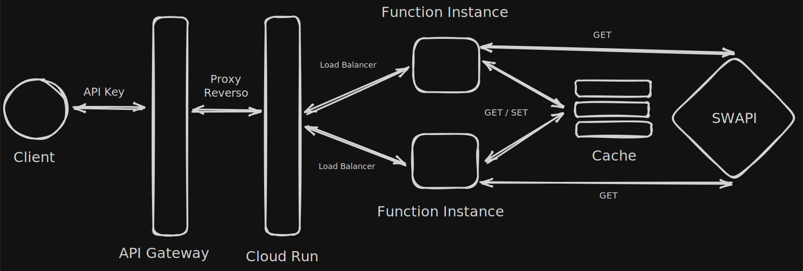

# Star Wars Function API

Desafio técnico feito pela [PowerOfData](https://www.powerofdata.ai/) para posição de Desenvolvedor Backend Júnior.
O Case consistia na criação de uma API que consumia a API do Star Wars e disponibilizava os recursos da maneira mais envolvente possível.
Nesse documento busco não só mostrar minha solução, como também mostrar os pensamentos que levaram a tomar certas decisões e os tradeoffs envolvidos. Espero que gostem!

### API Gateway Deploy

[https://swapi-function-gateway-2ruc61ah.uk.gateway.dev/](https://swapi-function-gateway-2ruc61ah.uk.gateway.dev/)

### Cloud Run Deploy

[https://swapi-func-api-217335873545.us-east4.run.app/](https://swapi-func-api-217335873545.us-east4.run.app/)

## Tecnologias Utilizadas

- [FastAPI](https://fastapi.tiangolo.com/)
Para a criação dos endpoints no Google Run Functions.
- [Docker](https://www.docker.com/)
Construção de containers reproduzíveis localmente e usado no GCP.
- [Pydantic](https://docs.pydantic.dev/latest/)
Validação dos dados de entrada e da função.
- [Pytest](https://docs.pytest.org/en/stable/)
Criação de testes unitários e de integração, com adicional de cobertura de testes.
- [Ruff](https://docs.astral.sh/ruff/) e [Pyright](https://github.com/microsoft/pyright)
LSP, linter, formater e typer, para padronização de código seguindo a PEP 8.
- [UV](https://docs.astral.sh/uv/)
Gerenciamento de ambientes virtuais e de dependências de forma determinística.
- [HTTPX](https://www.python-httpx.org/) e [Respx](https://lundberg.github.io/respx/)
Para as requisições e mocks da SWAPI.
- [Pre Commit](https://pre-commit.com/) e [GitHub Actions](https://github.com/features/actions)
Pipelines de CI para verificação do código antes e depois do git push.
- [Taskipy](https://github.com/taskipy/taskipy)
Simplificação de comandos de run, teste, lint, format no terminal.

> **Obs**: É claro que foram utilizadas as do critérios obrigatórios, no caso o [Python](https://www.python.org/), GCP com [Cloud Functions](https://cloud.google.com/functions) e [API Gateway](https://docs.cloud.google.com/api-gateway/docs).
> 

## Decisões de Design e Arquitetura do Código

### System Design

Representação simplifica do funcionamento geral do sistema, onde um cliente qualquer faz a requisição, usando a chave de autenticação no cabeçalho, para URL do API Gateway, nele, antes mesmo de chegar na aplicação, filtra as chamadas com base na chave e na especificação OpenAPI usado no deploy, se bem sucedida é encaminhado para o Cloud Run, que se encarga de direcionar os requests as instâncias sem sobrecarrega-las. As instâncias por sua vez, rodando em containers isolados tratarão de processar os dados, consultar o cache e se necessário fazer a requisição para API  do Star Wars. 



### Diagrama de Sequência

Diagrama mostrando o fluxo completo dentro da API, de uma requisição comum e suas tratativas de sucesso e falha em relação ao cache, além de abstrair os caminhos de outros serviços como de ordenação e expansão.


### Estrutura de Diretório e Arquivos

```bash
● starwars_func_api/
  ├── main.py         # Ponto de entrada: FastAPI, CORS, routers
  │
  ├── api/            # Endpoints HTTP (rotas REST versionadas)
  ├── services/       # Lógica de negócio (fetch, expand, sort, auth)
  ├── repositories/   # Acesso a dados (cache)
  ├── schemas/        # Modelos Pydantic (validação/serialização)
  ├── exceptions/     # Tratamento de erros (handlers, classes)
  ├── infra/          # Configurações e clientes externos (Redis, env)
  └── tests/          # Testes automatizados
```

### Framework

Anteriormente já tinha usado o [Functions Framework](https://github.com/GoogleCloudPlatform/functions-framework-python) tanto síncrono quanto assíncrono, para teste rápido de validação e deploy da ideia, mas com passar do tempo para maior robustez troquei para o FastAPI, pois já tinha integrado muito do que já tinha feito na versão async e trazias muitos benefícios como o Swagger e um controle melhor das rotas.

### Endpoints

O principal recurso é o endpoint `/swapi` após o versionamento da API em `/api/v1` , no qual recebe como Query Param os atributos:

| `resource` | Obrigatório, sendo apenas disponível os disponibilizados pela Star Wars API (films, people, starships, planets, species e vehicles). |
| --- | --- |
| `id` | Opcional, usado para acessar um resource específico, aceitado apenas inteiros positivos e não em conjunto com outros params. |
| `page` | Opcional, usado para paginação, também sendo um inteiro positivo e de uso impossibilitado com o id. |
| `search` | Opcional, usado para filtragem de recursos, sendo uma string livre que também tem seu uso limitado com id. |
| `expand` | Opcional, busca os dados do hyperlink HATEOAS dos campos especificados ou todos com all. |
| `sort_by` | Opcional, usado para selecionar o campo que sera base da ordenação, sendo uma string livre, sem id também. |
| `sort_order` | Opcional, até mesmo pelo sort_by, pois o padrão é asc, sendo um enum com a outra opção desc. Tendo uso restrito com sort_by. |

> **Obs**: Todos endpoints do recurso `swapi` estão protegidos pela API Key gerada pelo GCP e validada no código. Entretanto o endpoint `/docs` no root, tem sua visualização aberta para análise, ainda necessitando da API Key para as requisições.
> 

Preferi esta abordagem pela sua simplicidade e flexibilidade, uma vez que com esse único endpoint posso fazer o wrapper para o SWAPI, sem a necessidade da criação de várias rotas para cada recurso do SWAPI, como `/people`, `/films` e etc. Tornando assim a experiência mais agradável, pois entendo que o desafio não é fazer uma cópia do modelo RESTful da SWAPI, e sim utilizar-se da criatividade e conhecimento para construir uma solução inovadora. E segundo os próprios critérios:
*”Crie **um** endpoint que permita ao usuário consultar diferentes informações baseadas nos dados da API do Star Wars.”*

Claro que não precisava levar 100% ao pé da letra, mas me deu insight sobre essa solução. 

Há também o endpoint root em `/`, também protegido pela key, que apenas devolve na resposta uma lista dos recursos disponível semelhante a API original, servindo como uma espécie de de health check.

### Services

Seguindo temos o módulo de Services da aplicação, aqui eu separo lógicas de negócio com o código de rotas, dessa forma tenho a responsabilidade única (**S**OLID) para autenticação em `services/auth_service.py` e a lógica da aplicação em `services/swapi_data_service.py`, via Dependency Injection (SOLI**D**), além de atingir também o Open/Close Principal (S**O**LID).

### Authorization & Authentication

Antes de discutir mais afundo sobre o serviço que faz o wrap da API, quero comentar sobre minhas decisões de segurança. Inicialmente poderia aplicar autenticação via JWT como no [auth_router.py](https://github.com/sandrosmarzaro/fastpath/blob/main/app/api/v1/routers/auth_router.py) de outra aplicação minha, criando assim o token via formulário OAuth e fazendo seu refresh também, desenvolvidos de fato no [auth_service.py](https://github.com/sandrosmarzaro/fastpath/blob/main/app/services/auth_service.py), onde de fato utilizo do username com sub e adiciona uma expiração nele, para no fim codificar com o secret key e algoritmo.

Entretanto tal aplicação não possui usuários ou recursos que devem ser limitados pela autorização (pode ver uma implementação minha assim em [user_service.py](https://github.com/sandrosmarzaro/fastpath/blob/main/app/services/user_service.py)), então usei o recurso de API Key do próprio GCP esperando a chave no parâmetro `X-API-Key` do cabeçalho, apenas tenho a  lógica injetada do `services/auth_service` no Depends da rota de `/swapi` para fins do Swagger UI ter o campo também.

Variáveis de ambiente como as URLs, são gerenciadas pelo pydantic-settings em `infra/settings.py` que abstrai os valores contidos no `.env`, usando o `@lru_cache` do Python para funcionar como uma espécie de Singleton.

> Um exemplo do `.env` é deixado em `.env.example`.
> 

Por fim outro ponto necessário é a configuração de CORS no `main.py`, como API não possui front, então terá acessos de domínios diferentes, os principais são do API Gateway e Cloud Functions configurado, deixando o [localhost](http://localhost) apenas para testes, onde também permito apenas os métodos GET e OPTIONS por questão de redirect e autenticação do CORS, possibilitando o uso do `X-API-Key` no header. 

### Business Logic

O ponto do `swapi_data_service.py` é simples, apenas monta a URL de forma segura com base nos parâmetros e faz uma requisição GET assíncrona usando o HTTPX. Uma vez que os dados já foram validados pelo Pydantic em `schemas/swapi_query_params_schema.py`.

Agora se for passado o `expand` como all ou com outros campos, é chamado outro serviço, o `services/expand_swapi_data_service.py`, que usa o asyncio taks e gather para criar várias chamadas concorrentes de todos recursos obtidos na primeira chamada para API. Importante ser só a primeira camada para evitar problemas de N + 1 Queries e loops infinitos, mesmo não buscando todos os objetos nested, complemente  a  resposta com alta latência dependendo da página retornada.

Outra melhoria em service separado é a de ordenação no `sort_swapi_data_service.py`, chamado só quando passado os devido argumentos e com padrão ascendente, dentre a lista de resultados recebe qual campo será aplicado e aplica a função, tratando dados não padronizados, compondo duas listas, a ordena e a de dados defeituosos que segue a ordem padrão e só é mergeada pro final da ordenada.

### Cache

Foi implementado também o uso de cache, por meio de uma instância severless do Redis na [Upstash](https://upstash.com/), já que seu uso é coberto pelo free tier diferente do MemoryStore do GCP, dessa forma, devido 100% das requisições ser GET para leitura, pode se obter uma alta taxa de cache hit, no qual desafogaria as requisições para o SWAPI, diminuindo latência e uso do rate limite novamente. 

Para isso é feito um client em `infra/redis_client.py`, sendo uma instância singleton da mesma forma que settings, onde é injetada na camada de repository do `repositories/cache_repository.py`, abstraindo tanto a criação da key como o set e get dos valores, que por sua vez também será injetado no service do SWAPI, aplicado-se da estratégia aside, onde verifica-se primeiro a existência dessa key no banco, e utiliza-se em caso de sucesso, caso contrário, define esse valor no banco para futuras consultas não necessitar da chamada para o SWAPI.

O ponto negativo seria um aumento de latência nas primeiras requisições ou novas, já que o cache não vai estar presente e só vai aumentar o tempo de resposta. Fora ainda o vendor lock-in criado com Upstash, necessitando de uma segregação de interface (SOL**I**D) melhor no repository aplicando algum outro design pattern em conjunto como o Adapter.

### Validation e DTOs

A decisão de validar os campos enviados para SWAPI, é que ela iria devolver um erro também de qualquer forma, então com essa validação posso diminuir a latência, pois não estou mais fazendo chamadas na rede e diminuo o uso do rate limiting da API do Star Wars.  Podendo também fazer early returns no código para ficar mais limpo.

Uma decorrência da validação do Pydantic é lançar 422 Unprocessable Entity para todos os campos, então é quebrada um pouco a semântica REST, uma vez que o input de resources inexistentes não retorna 404 Not Found. Poderia até deixar o resource fora do schema e valida-lo antes ou depois do Pydantic, mas por simplicidade (KISS) e criação de uma documentação mais coerente do que estava fazendo, deixando todos padronizados.

### Error Handler

Sobre os erros lançados, fiz a classe de erros para padronizar os campos e o uso em `exceptions/erros.py` (que foi inspirado na [exceptions.py](https://github.com/polarsource/polar/blob/main/server/polar/exceptions.py) do projeto Open Source Polar, que venho observando aos poucos, assim como o [exception_handlers.py](https://github.com/polarsource/polar/blob/main/server/polar/exception_handlers.py)), evitado milhares de implementações que podem se divergir e repetir (DRY), tendo pior manutenibilidade já que seria mais difícil de adicionar campos como trace em cada ponto, melhorando também a escalabilidade. E todos os pontos são tratados no `exceptions/erro_handler.py`, onde são tratados uniformemente e inseridos no App. 

### Testes Unitários e de Integração

Testes para o core da aplicação foram criados dentro de `tests/test_swapi_data_service.py` e `tests/test_swapi_schema.py` , no qual verificam o funcionamento tanto do serviço de wrapper e seus serviços extras dependentes, como o schema que o alimenta. Todos eles foram feitos usando o `tests/conftest.py` que não só cria o cliente de teste do próprio FastAPI e utiliza uma fixture para isso, como cria várias outras fixtures de mocks do Respx para requisições do HTTPX.

A cobertura de testes no código é feita automaticamente pela extensão pystest-cov, no qual é possível acessar online por [https://app.codecov.io/gh/sandrosmarzaro/starwars_func_api](https://app.codecov.io/gh/sandrosmarzaro/starwars_func_api)

## Como Rodar

Nas duas formas deve-se lembrar de configurar o `.env` semelhante ao `.env.example`:

```bash
SWAPI_BASE_URL=https://swapi.dev/api/
API_GATEWAY_URL=https://my-api-12345678-uc.a.run.dev
CLOUD_FUNC_URL=https://my-api-run.12345.us-east4.app
CACHE_ENABLED=false
UPSTASH_REDIS_REST_URL=https://eu1-keen-swine-36397.upstash.io
UPSTASH_REDIS_REST_TOKEN=Abcdefghijklm0123456789
CACHE_TTL_SECONDS=86400
```

E ambos os casos, a API ficara rodando em [http://localhost:8080/](http://localhost:8080/)

E sendo possível de rodar os comandos do Taskipy disponíveis no `pyproject.toml` dentro do terminal para simplificar o uso:

```bash
task lint # checagem do Ruff
task type # checagem do Pyright
task commit # checagem do commit via Pre Commit  
task format # formatação do código via Ruff
task cover # visualização do coverage
task test # checagem dos testes do Pytest
```

### Via Docker

É possível rodar a aplicação usando o mesmo container em produção, basta baixar o projeto, buida-lo e executa-lo:

```bash
git clone git@github.com:sandrosmarzaro/starwars_func_api.git
cd starwars_func_api/
docker build -t swapi-func-api-image:1.0
docker run -it --rm --env-file .env -p 8080:8080 --name swapi-func swapi-func-api-image:1.0
```

> **Obs**: Se quiser passe a flag `-d`  ao invés da `-it` na hora de rodar o container para ter a aplicação de pé localmente em background sem ocupar o terminal, com isso pode-se utilizar o comando `docker exec -it swapi-func sh` para criar um novo terminal e executar os comandos (lembre-se que o UV não está na imagem final), ou quando quiser apenas usar o `docker attach swapi-func` para traze-lo de volta ao terminal. Sendo possível parar com `C -c`  ou com `docker stop swapi-func`.
> 

### Localmente

É necessário ter o UV instalado, pois por ele é gerenciado todas dependências, ambiente e até versão do Python, com ele podemos rodar tudo!

```bash
curl -LsSf https://astral.sh/uv/install.sh | sh # Download & Install UV
uv venv --python 3.13 # Download & Install Python
source .venv/bin/activate # Use Virtual Environment
uv sync # Download & Install dependencies
task run # Use Taskipy to run API
```

## Funcionalidades Extras

- Teste unitários e de integração com Pytest e Respx para mocks das chamadas do HTTPX
- Como uso do pytest-cov, faço o coverage para cobertura de testes, utilizei a plataforma da Codecov para subir os relatórios, disponíveis em:
[https://app.codecov.io/gh/sandrosmarzaro/starwars_func_api](https://app.codecov.io/gh/sandrosmarzaro/starwars_func_api)
- Parâmetro `expand`, para a busca de recursos aninhados pelo HATEOAS.
- Parâmetro `sort_by` e `sort_order`, para ordenação por campos específicos.
- Cache Aside com uma instância serverless do Redis no Upstash, evitando cargas no SWAPI.
- CI com GitHub Actions, no qual contém um workflow para rodar os lints, testes e atualizar o cover. O CD já foi automático com a integração do GCP.
- Autenticação gerenciada pelo próprio Google, onde é gerado a API KEY e especificada na documentação do OpenAPI, para no uso da requisição ser passada no header como `X-API-Key`.
- Container Docker com multi stage build e baseada em imagem Alpine, trazendo maior performance, e ainda uso de usuário não root para melhor segurança.
- Documentação automática do OpenAPI/Swagger disponível em `/docs` sem a necessidade da API Key, mas para fazer as requisições é necessário.

## Melhorias Futuras

- Eu já tinha testado inicialmente e decidi refatorar para manter o KISS, já que o Pydantic e Flask já esperam o throw de exceptions. Mas poderia fazer um estudo mais aprofundado de erros inspirado no Go, em retornar uma tupla com a resposta e erro (sendo nulo ou não) ao invés de levantar um erro e desviar o fluxo e usar recursos a mais da aplicação para isso. Programador Pragmático disse: *“Exceções são excepcionais”*. Mas como estava dando muitas voltas e criando mais código que antes para não lançar os erros, validar e repassa-los, reverti a decisão.
- Logs estruturados para telemetria de Observabilidade e Monitoramento, padronizado os já utilizados pela API, e as das bibliotecas/frameworks utilizadas. No código do Polar tem uma implementação interessante em [logging.py](https://github.com/polarsource/polar/blob/main/server/polar/logging.py) que mistura o logging para padronizar e usa o structlog na aplicação.
- Factory e Faker para criação dinâmica dos stubs no teste, sem a criação de vários mocks manuais.
- Já citei antes na parte de cache mas vale reprisar, em uma segregação de interface melhor nos padrões da API, construindo contratos que estabeleça regras mais padronizadas as classes que a implementam.
- Docker compose para subir o serviço localmente junto com uma instância Redis sem necessitar do uso da de produção, parte dessa implementação já fiz em outro projeto como [docker-compose.yaml](https://github.com/sandrosmarzaro/fastpath/blob/main/docker-compose.yaml), necessitando de ajustes nas env e criação do cliente.
- Refatorar as chamadas expands pra Background Task do FastAPI, retornando um 201 Accepted e a URL onde o recurso estará disponível, já que é uma execução mais prolongada.
- Pre condição do CD do GCP rodar somente após o CI de testes.
- Aproveitar o uso do Redis para criar um Rate limite da aplicação para proteção de recursos.
- Circuit Breaker nas chamadas para SWAPI, erros podem acontecer no caminho, então uma estratégia bem definida caso o circuito se abra é importante.
- Melhorar a arquitetura como usando a Clean, DDD, hexagonal, dentre outras.
- Redis cache mas usando os recursos pagos do GCP como o MemoryStore, ao invés do Upstash.
- Load balancer mais robusto com Cloud Load Balancing.
- WAF para filtragem de requisições maliciosas como de bots ou DDoS.
- Disponibilizar um endpoint com GraphQL, dessa forma pode-se obter informações específicas de vários recursos sem possuir um payload de resposta enorme.
- Avaliar o uso de uma Event-Driven Architecture como Pub/Sub, usando os Cloud Events do Functions Framework, ou mais escalabilidade ainda com Celery.
